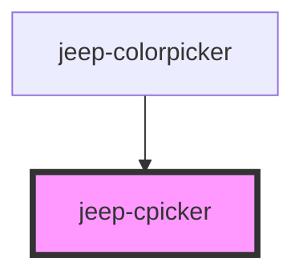

# jeep-cpicker

## Local custom CSS variables

| Variable                      | Default      |
| ----------------------------- | ------------ | 
|  --cpicker-top                | 10vh         |
|  --cpicker-left               | 10vw         |
|  --cpicker-width              | 70vmin       |
|  --cpicker-height             | 50vmin       |
|  --cpicker-background-color   | #242424      |
| ----------------------------- | ------------ | 

<!-- Auto Generated Below -->

## Properties

| Property      | Attribute     | Description               | Type      | Default     |
| ------------- | ------------- | ------------------------- | --------- | ----------- |
| `buttons`     | `buttons`     | The buttons text          | `string`  | `undefined` |
| `color`       | `color`       | The preselected color     | `string`  | `"#ff0000"` |
| `hidebuttons` | `hidebuttons` | Validation buttons hidden | `boolean` | `false`     |
| `hideheader`  | `hideheader`  | Header hidden             | `boolean` | `false`     |
| `hideopacity` | `hideopacity` | Opacity Slider hidden     | `boolean` | `false`     |
| `opacity`     | `opacity`     | The preselected opacity   | `string`  | `"1.000"`   |

## Events

| Event                     | Description | Type                     |
| ------------------------- | ----------- | ------------------------ |
| `jeepCpickerClose`        |             | `CustomEvent<CloseData>` |
| `jeepCpickerInstantColor` |             | `CustomEvent<Color>`     |
| `jeepCpickerOpen`         |             | `CustomEvent<any>`       |

## Methods

### `calcB(y: number, height: number) => Promise<number>`

Method get the vertical position for the brightness slider handler

#### Returns

Type: `Promise<number>`

### `calcH(y: number, height: number) => Promise<number>`

Method get the vertical position for the hue slider handler

#### Returns

Type: `Promise<number>`

### `calcO(y: number, height: number) => Promise<number>`

Method get the vertical position for the opacity slider handler

#### Returns

Type: `Promise<number>`

### `calcS(x: number, width: number) => Promise<number>`

Method get the horizontal position for the saturation slider handler

#### Returns

Type: `Promise<number>`

### `getStateProperties() => Promise<StateProperties>`

Method get StateProperties

#### Returns

Type: `Promise<StateProperties>`

### `getWrapperCssVariables() => Promise<any>`

Method get local wrapper css variables

#### Returns

Type: `Promise<any>`

### `init() => Promise<void>`

Method initialize

#### Returns

Type: `Promise<void>`

## Dependencies

### Used by

 - [jeep-colorpicker](..)

### Graph

----------------------------------------------

*Built with [StencilJS](https://stenciljs.com/)*
