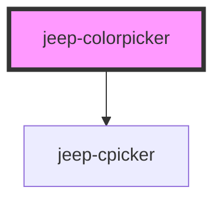

# jeep-colorpicker

    JeepColorpicker is a Web Component to select a color 
   
    JeepColorpicker owns a child Web Component JeepCpicker 
    which is rendered when the JeepColorpicker button is clicked which will fire the "JeepColorpickerOpen" event
   
    Color selection is done by 
      - clicking and/or dragging a cursor inside a picker area (Brightness and Saturation)
      - clicking and/or dragging the slider handle (Hue and Opacity)
    Each click on Brightness/Saturation or Hue and Opacity Areas will fire the "JeepColorpickerGetColor" event  
    Each move on the Brightness/Saturation cursor or on the Hue, Opacity handlers Areas fire the "JeepColorpickerGetColor" event  
    
    JeepCpicker consists of :
      - a background
      - a header : clickable area to toggle the text color format HEXA,RGBA,HSLA,HSBA
           -> left part: selected color
           -> right part: selected hue
           -> text: selected color text
      - a picker area: to select the Saturation and/or Brightness color component
      - an opacity slider: to select the Opacity color component
      - a hue slider: to select the Hue color component
      - a Okay button: to exit the Cpicker web component with the selected color
      - a Cancel button: to exit the Cpicker web component with the initial color

    Global and Local custom CSS variables have been implemented to help in the customization


## Global custom CSS variables

| Variable                                  | 
| ----------------------------------------- |  
|  --gcolorpicker-top                       | 
|  --gcolorpicker-left                      | 
|  --gcolorpicker-width                     | 
|  --gcolorpicker-height                    | 
|  --gcolorpicker-background-color          | 
|  --gcolorpicker-button-font-size          |  
|  --gcolorpicker-button-margin-top         |
|  --gcolorpicker-button-margin-left        |
|  --gcolorpicker-button-border             |
|  --gcolorpicker-button-border-color       |
|  --gcolorpicker-button-border-radius      |
|  --gcolorpicker-button-color              |
|  --gcolorpicker-button-background-color   |


## Local custom CSS variables

| Variable                               | Default      |
| -------------------------------------- | ------------ | 
|  --colorpicker-top                     | 10vh         |
|  --colorpicker-left                    | 10vw         |
|  --colorpicker-width                   | 70vmin       |
|  --colorpicker-height                  | 50vmin       |
|  --colorpicker-background-color        | #242424      |
|  --colorpicker-button-font-size        | 12px         | 
|  --colorpicker-button-margin-top       | 10px         |
|  --colorpicker-button-margin-left      | 10px         |
|  --colorpicker-button-border           | 2px solid)   |
|  --colorpicker-button-border-color     | black        |
|  --colorpicker-button-border-radius    | 5px 5px      |
|  --colorpicker-button-color            | black        |
|  --colorpicker-button-background-color | white        |

## Button Texts

The Text of the buttons can be customizable by using the property buttons.
The default are "Color Picker", "Okay" and "Cancel" 
ie 
  - buttons="[Color]"  will give "Color", "Okay" and "Cancel"  
  - buttons="[Color,Valid]"  will give "Color", "Valid" and "Cancel"  
  - buttons="[Color,Valid,Dismiss]"  will give "Color", "Valid" and "Dismiss"  
  - buttons="[Color,V,X]  will give "Color", "V" and "X" in this case the "V" button will have a green color and the "X" button will have a red color

## Usage
   
    ```html

    - using default values
        color : #ff0000 
        opacity : 1
     <jeep-colorpicker></jeep-colorpicker>
   
    - with a preselected color in hex format
     <jeep-colorpicker color="#00ff00"></jeep-colorpicker>
   
    - with a preselected opacity
     <jeep-colorpicker opacity="0.45"></jeep-colorpicker>

    - with the first button text given
      <jeep-colorpicker color="#ff0000" opacity="1.0" buttons="[Color]"></jeep-colorpicker>
    
    - with the two first button texts given
      <jeep-colorpicker color="#ff0000" opacity="1.0" buttons="[Color,Valid]"></jeep-colorpicker>

    - with the three button texts given
      <jeep-colorpicker color="#ff0000" opacity="1.0" buttons="[Color,Valid,Dismiss]"></jeep-colorpicker>

    - with the three button texts given and the two last with one character
      <jeep-colorpicker color="#ff0000" opacity="1.0" buttons="[Color,V,X]"></jeep-colorpicker>

    - with the text header hidden
      <jeep-colorpicker color="#ff0000" opacity="1.0" hideheader></jeep-colorpicker>

    - with the buttons hidden
      <jeep-colorpicker color="#ff0000" opacity="1.0" hidebuttons></jeep-colorpicker>

      after the color selection click on the container footer to close the color picker component and send the "JeepColorpickerGetColor" event

    - with the opacity slider hidden
      <jeep-colorpicker color="#ff0000" opacity="1.0" hideopacity></jeep-colorpicker>

    - with all 
     <jeep-colorpicker color="#00ff00" opacity="0.45" buttons="[Color]" hidebuttons hideheader hideopacity></jeep-colorpicker>

    ```
### Usage with preselected color and opacity and local custom CSS variables

    ```html
    <jeep-colorpicker style="--colorpicker-top:15vh;--colorpicker-left:5vw;   --colorpicker-width:40vw;--colorpicker-height:30vh;--colorpicker-background-color:#ffff00;--colorpicker-button-font-size:16px;--colorpicker-button-margin-top:30px;--colorpicker-button-margin-left:20px" color="#00ff00" opacity="0.5"></jeep-colorpicker>
    <script>
        var picker = document.querySelector('jeep-colorpicker');
        picker.addEventListener('jeepColorpickerGetColor', (ev) => {
            console.log(" getColor event ",ev.detail);     
        });
    </script>
    ```  

### Output
   
  -  the "jeepColorpickerGetColor" event return a Color Object

  ``` 
    {
      hsb : {
        hex: "#1d9aca", 
        hexa: "#1d9acab9"
      }
      rgb : {
        r: 29, 
        g: 154, 
        b: 202, 
        rgb: "RGB(29,154,202)", 
        rgba: "RGBA(29,154,202,0.725)"
      }
      hsl : {
        h: 196.647, 
        s: 74.892, 
        l: 45.294, 
        hsl: "HSL(197,75%,45%)", 
        hsla: "HSLA(197,75%,45%,0.725)"
      }
      hsb : {
        h: 196.79999999999998, 
        s: 85.55555555555556, 
        b: 79.33333333333333, 
        hsb: "HSB(197,86%,79%)", 
        hsba: "HSBA(197,86%,79%,0.725)"
      }
      opacity : 0.725
    }
  ``` 
  
  -  the "jeepColorpickerClose" event return a CloseData Object
  ``` 
    { color :
      {
        hsb : {
          hex: "#1d9aca", 
          hexa: "#1d9acab9"
        }
        rgb : {
          r: 29, 
          g: 154, 
          b: 202, 
          rgb: "RGB(29,154,202)", 
          rgba: "RGBA(29,154,202,0.725)"
        }
        hsl : {
          h: 196.647, 
          s: 74.892, 
          l: 45.294, 
          hsl: "HSL(197,75%,45%)", 
          hsla: "HSLA(197,75%,45%,0.725)"
        }
        hsb : {
          h: 196.79999999999998, 
          s: 85.55555555555556, 
          b: 79.33333333333333, 
          hsb: "HSB(197,86%,79%)", 
          hsba: "HSBA(197,86%,79%,0.725)"
        }
        opacity : 0.725
      },
      button : number  // 1 when "Okay" button has been clicked 
                       or 2 when the "Cancel" button has been clicked
    }
  ``` 

<!-- Auto Generated Below -->


## Properties

| Property      | Attribute     | Description               | Type      | Default     |
| ------------- | ------------- | ------------------------- | --------- | ----------- |
| `buttons`     | `buttons`     | The buttons text          | `string`  | `undefined` |
| `color`       | `color`       | The preselected color     | `string`  | `"#ff0000"` |
| `hidebuttons` | `hidebuttons` | Validation buttons hidden | `boolean` | `false`     |
| `hideheader`  | `hideheader`  | Header hidden             | `boolean` | `false`     |
| `hideopacity` | `hideopacity` | Opacity Slider hidden     | `boolean` | `false`     |
| `opacity`     | `opacity`     | The preselected opacity   | `string`  | `"1"`       |


## Events

| Event                     | Description | Type                     |
| ------------------------- | ----------- | ------------------------ |
| `jeepColorpickerClose`    |             | `CustomEvent<CloseData>` |
| `jeepColorpickerGetColor` |             | `CustomEvent<Color>`     |
| `jeepColorpickerOpen`     |             | `CustomEvent<any>`       |


## Methods

### `close(color: Color, button: number) => Promise<void>`

Method close the cpicker component

#### Returns

Type: `Promise<void>`


### `init() => Promise<void>`

Method initialize

#### Returns

Type: `Promise<void>`


### `open() => Promise<void>`

Method open the cpicker component

#### Returns

Type: `Promise<void>`


## Dependencies

### Depends on

- [jeep-cpicker](jeep-cpicker)

### Graph


----------------------------------------------

*Built with [StencilJS](https://stenciljs.com/)*
