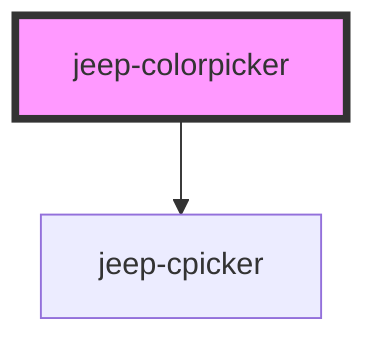

# jeep-colorpicker

## Global custom CSS variables

| Variable                                  | 
| ----------------------------------------- |  
|  --gcolorpicker-top                       | 
|  --gcolorpicker-left                      | 
|  --gcolorpicker-width                     | 
|  --gcolorpicker-height                    | 
|  --gcolorpicker-background-color          | 
|  --gcolorpicker-button-font-size          |  
|  --gcolorpicker-button-margin-top         |
|  --gcolorpicker-button-margin-left        |
|  --gcolorpicker-button-border             |
|  --gcolorpicker-button-border-color       |
|  --gcolorpicker-button-border-radius      |
|  --gcolorpicker-button-color              |
|  --gcolorpicker-button-background-color   |

## Local custom CSS variables

| Variable                               | Default      |
| -------------------------------------- | ------------ | 
|  --colorpicker-top                     | 10vh         |
|  --colorpicker-left                    | 10vw         |
|  --colorpicker-width                   | 70vmin       |
|  --colorpicker-height                  | 50vmin       |
|  --colorpicker-background-color        | #242424      |
|  --colorpicker-button-font-size        | 12px         | 
|  --colorpicker-button-margin-top       | 10px         |
|  --colorpicker-button-margin-left      | 10px         |
|  --colorpicker-button-border           | 2px solid)   |
|  --colorpicker-button-border-color     | black        |
|  --colorpicker-button-border-radius    | 5px 5px      |
|  --colorpicker-button-color            | black        |
|  --colorpicker-button-background-color | white        |

## Button Texts

The Text of the buttons can be customizable by using the property buttons.
The default are "Color Picker", "Okay" and "Cancel" 
ie 
  - buttons="[Color]"  will give "Color", "Okay" and "Cancel"  
  - buttons="[Color,Valid]"  will give "Color", "Valid" and "Cancel"  
  - buttons="[Color,Valid,Dismiss]"  will give "Color", "Valid" and "Dismiss"  
  - buttons="[Color,V,X]  will give "Color", "V" and "X" in this case the "V" button will have a green color and the "X" button will have a red color

<!-- Auto Generated Below -->

## Properties

| Property      | Attribute     | Description               | Type      | Default     |
| ------------- | ------------- | ------------------------- | --------- | ----------- |
| `buttons`     | `buttons`     | The buttons text          | `string`  | `undefined` |
| `color`       | `color`       | The preselected color     | `string`  | `"#ff0000"` |
| `hidebuttons` | `hidebuttons` | Validation buttons hidden | `boolean` | `false`     |
| `hideheader`  | `hideheader`  | Header hidden             | `boolean` | `false`     |
| `hideopacity` | `hideopacity` | Opacity Slider hidden     | `boolean` | `false`     |
| `opacity`     | `opacity`     | The preselected opacity   | `string`  | `"1"`       |

## Events

| Event                     | Description | Type                     |
| ------------------------- | ----------- | ------------------------ |
| `jeepColorpickerClose`    |             | `CustomEvent<CloseData>` |
| `jeepColorpickerGetColor` |             | `CustomEvent<Color>`     |
| `jeepColorpickerOpen`     |             | `CustomEvent<any>`       |

## Methods

### `close(color: Color, button: number) => Promise<void>`

Method close the cpicker component

#### Returns

Type: `Promise<void>`

### `init() => Promise<void>`

Method initialize

#### Returns

Type: `Promise<void>`

### `open() => Promise<void>`

Method open the cpicker component

#### Returns

Type: `Promise<void>`

## Dependencies

### Depends on

- [jeep-cpicker](jeep-cpicker)

### Graph

----------------------------------------------

*Built with [StencilJS](https://stenciljs.com/)*
