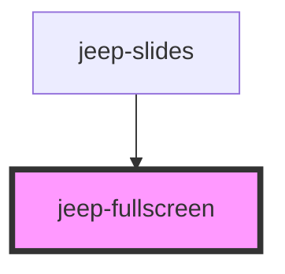

# jeep-navigation

## Local custom CSS variables

| Variable                           | Default     |
| ---------------------------------- | ----------- | 
|  --fullscreen-top                  | 10px        |
|  --fullscreen-left                 | 10px        |
|  --fullscreen-width                | 100%        |
|  --fullscreen-button-width         | 50px        |
|  --fullscreen-button-height        | 50px        |
|  --fullscreen-button-icon-color    | #222428     |
| ---------------------------------  | ----------- | 

<!-- Auto Generated Below -->

## Events

| Event                   | Description                       | Type                |
| ----------------------- | --------------------------------- | ------------------- |
| `jeepFullscreenChange`  | Emitted when Fullscreen Change    | `CustomEvent<void>` |
| `jeepFullscreenExit`    | Emitted when Fullscreen Exit      | `CustomEvent<void>` |
| `jeepFullscreenRequest` | Emitted when Fullscreen Requested | `CustomEvent<void>` |

## Methods

### `fullscreenExit() => Promise<void>`

Exit Fullscreen

#### Returns

Type: `Promise<void>`

### `fullscreenRequest(elem: any) => Promise<void>`

Request Fullscreen

#### Returns

Type: `Promise<void>`

### `init() => Promise<void>`

Init data from properties.

#### Returns

Type: `Promise<void>`

### `isFullscreen() => Promise<boolean>`

Is Fullscreen

#### Returns

Type: `Promise<boolean>`

### `setFullscreen() => Promise<void>`

Set the Fullscreen component.

#### Returns

Type: `Promise<void>`

### `setJeepFullscreenVisibility(state: any) => Promise<void>`

Set the Fullscreen Visibility (visible/hidden)

#### Returns

Type: `Promise<void>`

## Dependencies

### Used by

 - [jeep-slides](..)

### Graph

----------------------------------------------

*Built with [StencilJS](https://stenciljs.com/)*
