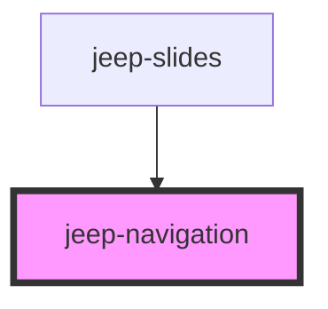

# jeep-navigation

## Local custom CSS variables

| Variable                          | Default    |
| --------------------------------- | ---------- | 
|  --navigation-top                 | 50%        |
|  --navigation-left                | 0          |
|  --navigation-width               | 100vw      |
|  --navigation-button-width        | 50px       |
|  --navigation-button-height       | 50px       |
|  --navigation-padding-horizontal  | 10px       |
|  --navigation-button-icon-color   | #222428    |
| --------------------------------- | ---------- | 

<!-- Auto Generated Below -->

## Properties

| Property | Attribute | Description                                                      | Type     | Default     |
| -------- | --------- | ---------------------------------------------------------------- | -------- | ----------- |
| `name`   | `name`    | The navigation icon name must be "arrow-circle" or "arrow-round" | `string` | `undefined` |

## Events

| Event                | Description                                  | Type                |
| -------------------- | -------------------------------------------- | ------------------- |
| `jeepNavigationNext` | Emitted when the next button was clicked     | `CustomEvent<void>` |
| `jeepNavigationPrev` | Emitted when the previous button was clicked | `CustomEvent<void>` |

## Methods

### `getJeepNavigationIconFamily() => Promise<string>`

Get icon name

#### Returns

Type: `Promise<string>`

### `init() => Promise<void>`

Init data from properties.

#### Returns

Type: `Promise<void>`

### `setJeepNavigationNextDisabled(state: any) => Promise<void>`

Set the Navigation next button to enable/disable

#### Returns

Type: `Promise<void>`

### `setJeepNavigationPrevDisabled(state: any) => Promise<void>`

Set the Navigation previous button to enable/disable

#### Returns

Type: `Promise<void>`

### `setJeepNavigationVisibility(state: any) => Promise<void>`

Set the Navigation Visibility (visible/hidden)

#### Returns

Type: `Promise<void>`

### `setNavigation() => Promise<void>`

Set the navigation component.

#### Returns

Type: `Promise<void>`

## Dependencies

### Used by

 - [jeep-slides](..)

### Graph

----------------------------------------------

*Built with [StencilJS](https://stenciljs.com/)*
