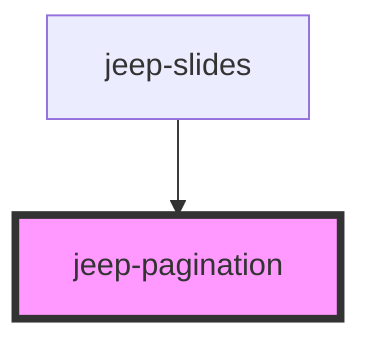

# jeep-navigation

## Local custom CSS variables

| Variable                        | Default    |
| ------------------------------- | ---------- | 
|  --pagination-top               | 5%         |
|  --pagination-left              | 0          |
|  --pagination-width             | 100vw      |
|  --pagination-height            | 100vh      |
|  --bullet-background            | #000000    |
|  --bullet-opacity               | 0.5        |
|  --bullet-active-background     | #ff8000    |
|  --bullet-active-opacity        | 1          |
|  --bullet-active-diameter       | 22px       |
|  --bullet-diameter              | 15px       |
| ------------------------------- | ---------- | 

<!-- Auto Generated Below -->

## Properties

| Property    | Attribute   | Description                            | Type      | Default     |
| ----------- | ----------- | -------------------------------------- | --------- | ----------- |
| `clickable` | `clickable` | The pagination clickable option        | `boolean` | `undefined` |
| `direction` | `direction` | The pagination direction               | `string`  | `undefined` |
| `ndisplay`  | `ndisplay`  | The pagination number of items display | `number`  | `undefined` |

## Events

| Event                 | Description                                  | Type                           |
| --------------------- | -------------------------------------------- | ------------------------------ |
| `jeepPaginationIndex` | Emitted when a pagination bullet was clicked | `CustomEvent<PaginationIndex>` |

## Methods

### `getJeepPaginationBulletNumber() => Promise<number>`

Get the Pagination Number of bullets displayed

#### Returns

Type: `Promise<number>`

### `init() => Promise<void>`

Init data from properties.

#### Returns

Type: `Promise<void>`

### `setJeepPaginationActiveIndex(state: any) => Promise<void>`

Set the Pagination Active Index

#### Returns

Type: `Promise<void>`

### `setJeepPaginationSlidesNumber(state: any) => Promise<void>`

Set the Pagination Slides Number

#### Returns

Type: `Promise<void>`

### `setJeepPaginationVisibility(state: any) => Promise<void>`

Set the Pagination Visibility (visible/hidden)

#### Returns

Type: `Promise<void>`

## Dependencies

### Used by

 - [jeep-slides](..)

### Graph

----------------------------------------------

*Built with [StencilJS](https://stenciljs.com/)*
