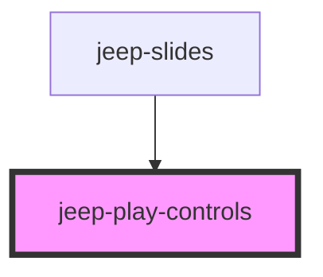

# jeep-navigation

## Local custom CSS variables

| Variable                           | Default     |
| ---------------------------------- | ----------- | 
|  --playcontrols-top                | 100vh -20px |
|  --playcontrols-left               | 0           |
|  --playcontrols-width              | 100%        |
|  --playcontrols-button-width       | 50px        |
|  --playcontrols-button-height      | 50px        |
| ---------------------------------  | ----------- | 

<!-- Auto Generated Below -->

## Properties

| Property    | Attribute   | Description                                                                  | Type     | Default     |
| ----------- | ----------- | ---------------------------------------------------------------------------- | -------- | ----------- |
| `duration`  | `duration`  | The play controls duration time time to stay on same slide                   | `number` | `undefined` |
| `fromslide` | `fromslide` | The play controls from slides number The first slide index is 0              | `number` | `undefined` |
| `nslides`   | `nslides`   | The play controls slides number                                              | `number` | `undefined` |
| `toslide`   | `toslide`   | The play controls to slides number The last slide index is slides.length - 1 | `number` | `undefined` |

## Events

| Event                                  | Description                                        | Type                              |
| -------------------------------------- | -------------------------------------------------- | --------------------------------- |
| `jeepPlayControlsAutoplayPause`        | Emitted when autoplay pause button clicked         | `CustomEvent<void>`               |
| `jeepPlayControlsAutoplaySkipBackward` | Emitted when autoplay skip backward button clicked | `CustomEvent<void>`               |
| `jeepPlayControlsAutoplaySkipForward`  | Emitted when autoplay skip forward button clicked  | `CustomEvent<void>`               |
| `jeepPlayControlsAutoplayStart`        | Emitted when autoplay start button clicked         | `CustomEvent<void>`               |
| `jeepPlayControlsAutoplayStop`         | Emitted when autoplay stop button clicked          | `CustomEvent<void>`               |
| `jeepPlayControlsCurrentIndex`         | Emitted when the current index change              | `CustomEvent<{ index: string; }>` |
| `jeepPlayControlsIsBeginning`          | Emitted when current index is fromslide            | `CustomEvent<void>`               |
| `jeepPlayControlsIsEnd`                | Emitted when current index is toslide              | `CustomEvent<void>`               |

## Methods

### `autoplayPause() => Promise<void>`

Pause autoplay

#### Returns

Type: `Promise<void>`

### `autoplayStart() => Promise<void>`

Start autoplay

#### Returns

Type: `Promise<void>`

### `autoplayStop() => Promise<void>`

Stop autoplay

#### Returns

Type: `Promise<void>`

### `getCurrentIndex() => Promise<number>`

Get PlayControls Current Index

#### Returns

Type: `Promise<number>`

### `getJeepPlayControlsDuration() => Promise<number>`

Get the PlayControls duration

#### Returns

Type: `Promise<number>`

### `init() => Promise<void>`

Init data from properties.

#### Returns

Type: `Promise<void>`

### `isPlaying() => Promise<boolean>`

Is Playing

#### Returns

Type: `Promise<boolean>`

### `setActiveIndexAndPlay(index: number) => Promise<void>`

Set PlayControls Active Index

#### Returns

Type: `Promise<void>`

### `setCurrentIndex(index: number, notemit?: boolean) => Promise<void>`

Set PlayControls Current Index

#### Returns

Type: `Promise<void>`

### `setJeepPlayControlsSkipBackwardDisabled(state: any) => Promise<void>`

Set the PlayControls skipbackward icon to enable/disable

#### Returns

Type: `Promise<void>`

### `setJeepPlayControlsSkipForwardDisabled(state: any) => Promise<void>`

Set the PlayControls skipforward icon to enable/disable

#### Returns

Type: `Promise<void>`

### `setJeepPlayControlsVisibility(state: any) => Promise<void>`

Set the PlayControls Visibility (visible/hidden)

#### Returns

Type: `Promise<void>`

### `setPlayControls() => Promise<void>`

Set the PlayControls component.

#### Returns

Type: `Promise<void>`

## Dependencies

### Used by

 - [jeep-slides](..)

### Graph

----------------------------------------------

*Built with [StencilJS](https://stenciljs.com/)*
