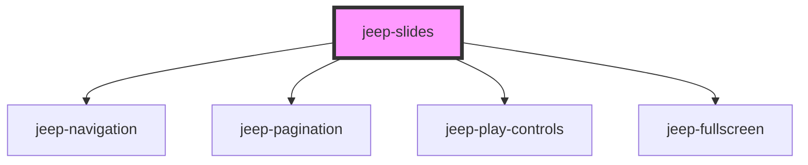

# jeep-slides

Stencil Web Component using CSS snap points to walk through slides.

The Web component tag is ```<jeep-slides>``` and uses the following embedded components:
  - ```<jeep-slide>```
  - ```<jeep-pagination>```
  - ```<jeep-navigation>```
  - ```<jeep-play-controls>```
  - ```<jeep-fullscreen>```

All components are using shadow DOM

Following Keyboard events are available
  - arrow (UP,DOWN) when direction is vertical
  - arrow (LEFT, RIGHT) when direction is horizontal

Global and Local custom CSS variables have been implemented to help in the customization

## Global custom CSS variables

| Variable                                  | 
| ----------------------------------------- |  
|  --gslides-margin-top                     | 
|  --gslides-margin-left                    | 
|  --gslides-margin-right                   | 
|  --gslides-margin-bottom                  | 
|  --gslides-background-color               | 
|  --gslides-pagination-bottom              | 
|  --gslides-pagination-right               | 
|  --gslides-bullet-active-diameter         | 
|  --gslides-bullet-diameter                | 
|  --gslides-bullet-background              | 
|  --gslides-bullet-opacity                 | 
|  --gslides-bullet-active-background       | 
|  --gslides-bullet-active-opacity          | 
|  --gslides-navigation-button-width        | 
|  --gslides-navigation-button-height       | 
|  --gslides-navigation-padding-horizontal  | 
|  --gslides-navigation-button-icon-color   | 
|  --gslides-playcontrols-bottom            |
|  --gslides-playcontrols-left              |
|  --gslides-playcontrols-width             |
|  --gslides-playcontrols-button-width      |
|  --gslides-playcontrols-button-height     |
|  --gslides-fullscreen-top                 |
|  --gslides-fullscreen-left                |
|  --gslides-fullscreen-button-width        |
|  --gslides-fullscreen-button-height       |
|  --gslides-fullscreen-button-icon-color   |
|  --gslides-slide-scroll-snap-align        | 
|  --gslides-slide-background               |
|  --gslides-slide-color                    |
|  --gslides-slide-title-font-size          |              
|  --gslides-slide-subtitle-font-size       |
|  --gslides-slide-content-top              |
|  --gslides-slide-content-padding          |
|  --gslides-slide-content-font-size        |
|  --gslides-slide-content-text-align       |
|  --gslides-slide-header-top               |
| ----------------------------------------- |  


## Local custom CSS variables

| Variable                                 | Default      |
| ---------------------------------------- | ------------ | 
|  --slides-margin-top                     | 0px          |
|  --slides-margin-left                    | 0px          |
|  --slides-margin-right                   | 0px          |
|  --slides-margin-bottom                  | 0px          |
|  --slides-background-color               | transparent  |
|  --slides-pagination-bottom              | 15px         |
|  --slides-pagination-right               | 5px          |
|  --slides-bullet-active-diameter         | 24px         |
|  --slides-bullet-diameter                | 15px         |
|  --slides-bullet-background              | #000000      |
|  --slides-bullet-opacity                 | 0.5          |
|  --slides-bullet-active-background       | #ff8000      |
|  --slides-bullet-active-opacity          | 1            |
|  --slides-navigation-button-width        | 50px         |
|  --slides-navigation-button-height       | 50px         |
|  --slides-navigation-padding-horizontal  | 10px         |
|  --slides-navigation-button-icon-color   | #222428      |
|  --slides-playcontrols-bottom            | 20px         |
|  --slides-playcontrols-button-width      | 50px         |
|  --slides-playcontrols-button-height     | 50px         |
|  --slides-fullscreen-top                 | 10px         |
|  --slides-fullscreen-left                | 10px         |
|  --slides-fullscreen-button-width        | 50px         |
|  --slides-fullscreen-button-height       | 50px         |
|  --slides-fullscreen-button-icon-color   | #222428      |
|  --slides-slide-scroll-snap-align        | start        |
|  --slides-slide-background               |              |
|  --slides-slide-color                    |              |
|  --slides-slide-title-font-size          |              |
|  --slides-slide-subtitle-font-size       |              |
|  --slides-slide-content-top              |              |
|  --slides-slide-content-padding          |              |
|  --slides-slide-content-font-size        |              |
|  --slides-slide-content-text-align       |              |
|  --slides-slide-header-top               |              |
| ---------------------------------------- | ------------ | 

## Usage 

The ```jeep-slide``` component should be in a ```<div slot="slides">``` 

```html
  <jeep-slides options = '{"direction":"horizontal"}'>
    <div slot="slides">
      <jeep-slide stitle="Section One" cstyle=":host{--slide-background: #49b293;
      --slide-display:block;--slide-header-top:2vmin;--slide-content-top:4vmin;--slide-content-padding: 0 2vmin;
      --slide-content-text-align:left;--slide-content-font-size:4.7vmin;}">
        <h4 style="margin-top:2vmin;margin-bottom:2vmin;font-size:5vmin;font-weight:bold;">Below a list of items :</h4>
        <ul style="margin-top: 0.5vmin;">
          <li>Lorem ipsum dolor sit amet, consectetur adipiscing elit. Aliquam dictum mattis velit, sit amet faucibus felis iaculis nec.</li>
          <li>Nulla laoreet justo vitae porttitor porttitor. Suspendisse in sem justo. Integer laoreet magna nec elit suscipit, ac laoreet nibh euismod.</li>
        </ul>
      </jeep-slide>  
      <jeep-slide cstyle=":host{--slide-background: #c94e4b;}">Section Two</jeep-slide>
      <jeep-slide cstyle=":host{--slide-background: #4cc1be;}">Section Three</jeep-slide>
    </div>
  </jeep-slides>

``` 

<!-- Auto Generated Below -->


## Properties

| Property  | Attribute | Description        | Type     | Default     |
| --------- | --------- | ------------------ | -------- | ----------- |
| `options` | `options` | The slides options | `string` | `undefined` |


## Events

| Event                        | Description                          | Type                            |
| ---------------------------- | ------------------------------------ | ------------------------------- |
| `jeepSlidesHeaderVisibility` | Emitted the Header visibility change | `CustomEvent<HeaderVisibility>` |


## Methods

### `getActiveSlideIndex() => Promise<number>`

Get Active Slide Index.

#### Returns

Type: `Promise<number>`


### `init() => Promise<void>`

Init data from properties.

#### Returns

Type: `Promise<void>`


### `setSlides() => Promise<void>`

Set the slides.

#### Returns

Type: `Promise<void>`


## Dependencies

### Depends on

- [jeep-navigation](jeep-navigation)
- [jeep-pagination](jeep-pagination)
- [jeep-play-controls](jeep-play-controls)
- [jeep-fullscreen](jeep-fullscreen)

### Graph


----------------------------------------------

*Built with [StencilJS](https://stenciljs.com/)*
