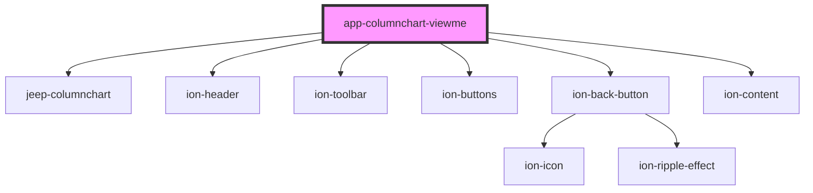

# app-columnchart-viewme

<!-- Auto Generated Below -->

## Properties

| Property | Attribute | Description | Type     | Default     |
| -------- | --------- | ----------- | -------- | ----------- |
| `type`   | `type`    |             | `string` | `undefined` |

## Dependencies

### Depends on

- jeep-columnchart
- ion-header
- ion-toolbar
- ion-buttons
- ion-back-button
- ion-content

### Graph

----------------------------------------------

*Built with [StencilJS](https://stenciljs.com/)*
