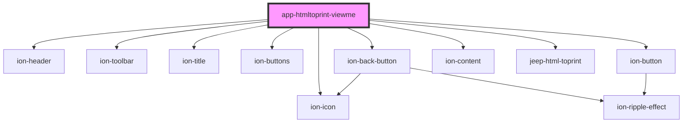

# app-htmltoprint-viewme

<!-- Auto Generated Below -->

## Dependencies

### Depends on

- ion-header
- ion-toolbar
- ion-title
- ion-buttons
- ion-back-button
- ion-button
- ion-icon
- ion-content
- jeep-html-toprint

### Graph

----------------------------------------------

*Built with [StencilJS](https://stenciljs.com/)*
